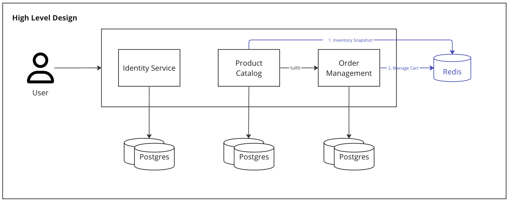
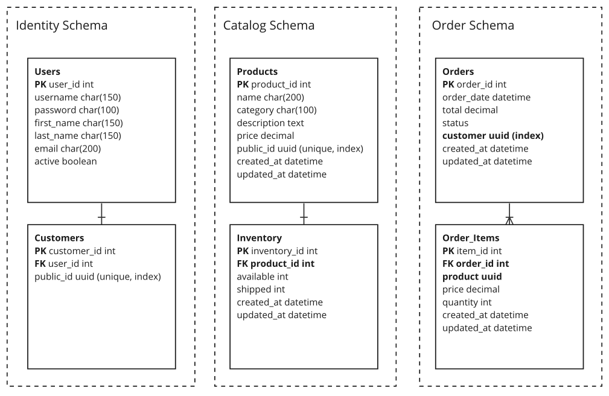
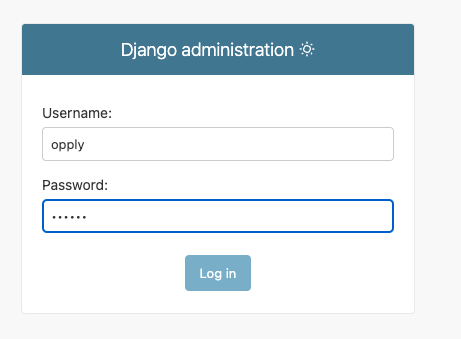
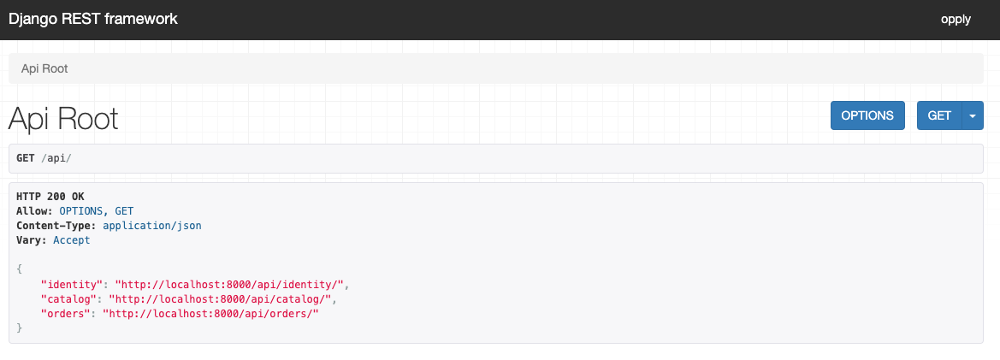

# Opply E-Commerce Workspace

# Overview

This is an assessment to build the backend of a mobile application to Opply customers. This app will allow users to order products using their phones.

## Requirements

### Product

- Customers may exchange their username and password for an authentication token
- Customers may see a paginated list of products. Each product in the list should have the following details: id, name, price, and quantity in stock
- Customers may order the products they need
- Number of products in stock should decrease after an order is made
- Customers may see their history of orders.

### Technical

- Django 4.x (any modules, any data structures)
- API only, no need for UI
- Production ready
- Deployment instructions to AWS

## High Level Design



This Django project will be composed by three distinct apps (modules):

1. User Identity: Register, Authenticate, Generate tokens and maintain users (customers)
2. Product Catalog: Maintain de catalog of products and up-to-date inventory levels.
3. Order Management: Create and maintain orders and update inventory on the product catalog.

### Reduce Latency loading a large dataset of products

The Product Catalog will be the most accessed APIs on the system, both to read the list of product and to maintain the inventory. We need to provide a few mechanisms to make sure users will have a good experience loading products and to reduce the concurrency between reads (product lists) and writes (update inventory):

- Pagination
- Filters
- Cache
- Primary and Secondary databases (Writes/Reads)

### Orders & Inventory Management

The biggest challenge on every e-commerce app is on the inventory management. We want to reduce the risk of the following issues happen:

- Different users odering the same last product and receiving a late feedback informing that the order was cancelled or will be partially satisfied

- Users unable to finish an order because the product is not available anymore

The best way to make this happen is to implement a Shopping Cart where the availability will be validated every time a new product is added to the cart.

1. User see the list of products from a snapshot of the current inventory (in memory cached on redis).

2. User try to add one specific product item with quantity to the shopping cart.

3. The system check the availability and reserve the specific number of items (in memory) if it is available. Out-of-stock products are automatically removed from the list.

4. User add a few other items to the cart and confirm the order. On this moment all the product items are validated and removed definitely from the inventory on the database.

5. Even with the fast-feedback to the user in the shopping cart there are still a small risk of one or more product items to be out-of-stock on the moment of the order creation

6. Two possibles strategies can be used on order creation: "All or nothing" or "Partially satisfied". On this exercise I am assuming that all order-items needs to be available in the stock on the moment of the order creation, otherwise the order will not be created.

7. Shopping Carts will have a TTL on Redis. So abandoned carts are automatically cleaned after X minutes/hours/days.

> Due to the time restrictions, I will not implement the in-memory product list snapshot neither the shopping cart.

### Reduce Latency and scalability on order creation

As the system scales we may have multiple users trying to generate orders related to the same product. This may cause some latency due to multiple transactions locking the database to update the same inventory. Possible strategies to solve this issue:

1. Remove inventory update on the database from order creation: Keep the in-memory Redis/Memcache as the source of truth to inventory levels. Send order_created events to a queue (Kafka, SNS, etc), and
   create a new Order Fulfillment consumer to read these events from the queue, persist the inventory on the database to satisfy the order and change the order status
2. Segregate database reads/writes using primary and secondary dbs

## Database Schema (Logical)



# How to run this project?

## Requirements

Before run this project you need to have the following dependencies installed

- Python 3.9
- Docker
- Docker-Compose
- Make (optional)

## Quick Start

To start this project you just need to duplicate the .env file and run the app using the shortcut. It will start all the resources on docker, load the initial seed on the database, build and run the api.

Create the .env file based on sample

```
cp ./opply_project/.env.sample ./opply_project/.env
```

Start the app

```
make run-docker
```

Once the app is running you can authenticate in the Djando Admin and navigate to the apis using the DRF entrypoint route

1. Authenticate in the Django admin (user: opply / password: 123456)

```
http://localhost:8000/admin/
```



2. Navigate to the DRF entrypoint

```
http://localhost:8000/api/
```



> Most endpoints are protected and will require a Bearer header token if you are not authenticated in the Django admin.

## Endpoints

| Endpoint                 | Method | Description                                         |
| ------------------------ | ------ | --------------------------------------------------- |
| /api/identity/register/  | POST   | Create a new user                                   |
| /api/identity/token/     | POST   | Generates a new token to an existent user           |
| /api/identity/customers/ | \*     | All operations related to customers                 |
| /api/catalog/products/   | \*     | All operations related to products                  |
| /api/orders/orders/      | POST   | Place an order with order items                     |
| /api/orders/orders/      | GET    | Get a list of all orders for the authenticated user |
| /api/orders/orders/{id}  | GET    | Get details of a specific order                     |

## Project Structure

| Directory/File       | Description                                                                                              |
| -------------------- | -------------------------------------------------------------------------------------------------------- |
| `opply_project/`     | Root directory of the Django project                                                                     |
| `├── config/`        | Project-specific Django settings                                                                         |
| `├── api/`           |                                                                                                          |
| `├──── identity/`    | Identity app (user and customer models, views, etc.)                                                     |
| `├──── catalog/`     | Product Catalog app (product models, views, etc.)                                                        |
| `├──── orders/`      | Order Management app (order models, views, etc.)                                                         |
| `├──── common/`      | Common methods and utilities used by all other apps                                                      |
| `├── manage.py`      | Django's command-line utility for administrative tasks                                                   |
| `requirements.txt`   | Contains the Python dependencies for this project                                                        |
| `Dockerfile`         | Defines how to build the Docker image for this Django application                                        |
| `docker-compose.yml` | Defines the services that make up the application so they can be run together in an isolated environment |

## Development Workflow

During development, you can modify the Django code, and the **changes will be automatically detected and applied**. Any new dependency needs to be added to the `requirements.txt` using `pip freeze > ./opply_project/requirements.txt`.

## Configuration

**Django Settings**: The project-specific Django settings are located in the config/settings directory. You can modify these files to adjust the project's configuration based on your needs.

**Database**: This project uses PostgreSQL as the database. Each module tables are organized on different schemas (identity, products, orders) and are living on two different servers (Primary/Secondary) with auto-replication.

## Relevant libraries

- Django
- Django Rest Framework
- Django Environ
- Django Rest Framework Simple JWT
- Django Guid
- Pytest
- Pytest-Django

# Deployment instructions

### Django [deployment checklst](https://docs.djangoproject.com/en/5.0/howto/deployment/checklist/)

- Run the check deploy script
- Provide a production secret key
- Make sure `debug` flag is disabled
- Configure a web server in front of Django application server
- Change `Allowed hosts` to only receive requests from the web server
- Review Django local `CACHE` configuration and move to a more scalable caching solution like Redis or MemCache
- Review `Database` configuration: Cluster, connection pool, secrets, etc
- Serve `Static files` from web server (if needed)
- Use HTTPS
- Review Performance optimizations
- Reduce `Logging` verbosity to production
- Review list and notifications to `Admins` and `Managers`

### Deployment to **AWS**

1. Straighforward option: Deploy to Elastic Beanstalk following the [step-by-step provided by AWS](https://docs.aws.amazon.com/elasticbeanstalk/latest/dg/create-deploy-python-django.html)

2. Cheaper and resilient option (preferable): EC2 + RDS (Aurora) + Nginx + Memcache

- Setup AWS account
- Launch a new EC2 instance
- Connect to the machine using SSH
- Install all the required dependencies (Python, pip, virtualenv)
- Setup a new virtualenv
- Upload app project files
- Install required packages from `requirements.txt`
- Setup Database on RDS
- Setup Memcache instances
- Setup ELB and autoscale groups
- Configure a webserver

## Next steps

- Primary / Secondary Postgres database (split read and writes requests)
- Cache (products)
  - Cache aside strategy (read from cache and fallback to db)
  - Updates to product inventory and orders re-writes the cache
- Retry with idempotency
  - Each request id is stored in memory
  - Duplicated requests return from cache
- Product Categories with filters
